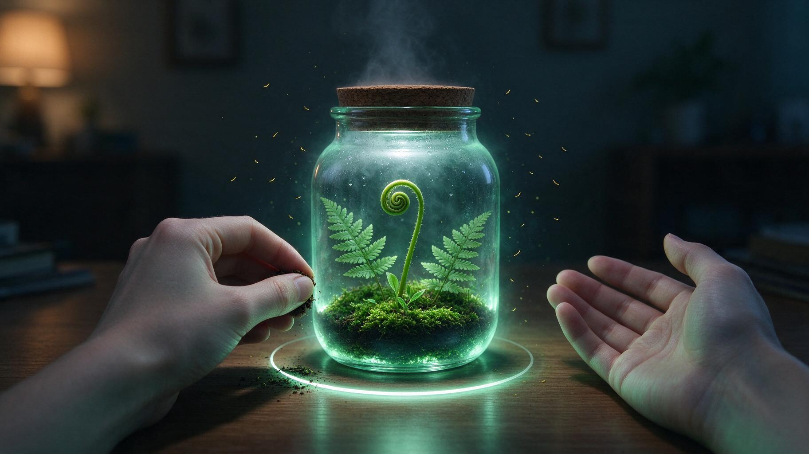
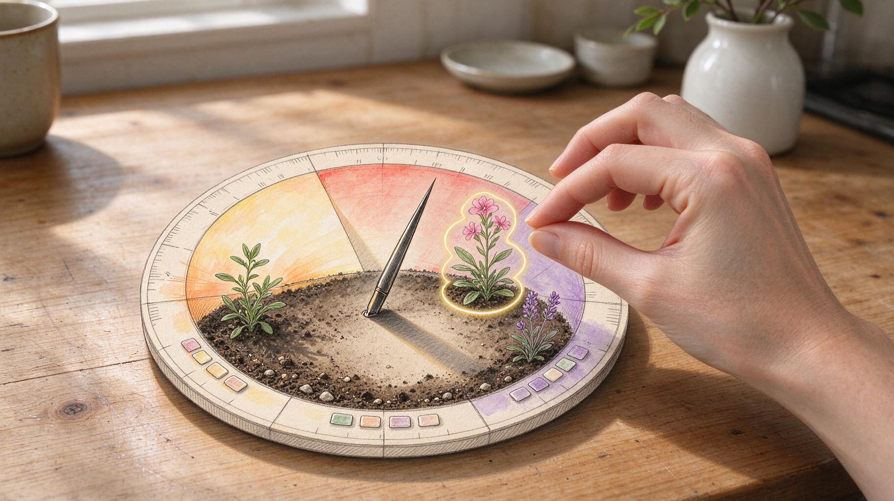

# Garden VR

**Two calm, hands-first daily-ritual apps that grow a living garden from your real habits.**
Built for the **Meta VR Start Developer Competition 2026** (Productivity track) on Meta Quest and Meta VR Glasses, and
developed **PC-first**: the mechanics, art and audio are mastered on Windows with keyboard and mouse standing in for
hands, and Quest integration follows only once each app proves useful, seamless and beautiful.

| | **Terrarium** | **Sundial** |
|---|---|---|
| Folder | [`apps/terrarium`](apps/terrarium) | [`apps/sundial`](apps/sundial) |
| Idea | A cork-topped glass jar on your real desk. Pinch and hold to breathe in, let go to breathe out, and a glowing fern uncoils with your breath. Six breaths, and a frond stays for good. | A watercolour-and-ink sundial on your real table. Its shadow follows the real clock across morning, midday and dusk; read your day in two seconds, tend it in twenty. |
| Art direction | **Night Moss**: extend reality, add glow and magic on top | **Field Notebook**: hand-drawn art mixed into reality |
| Daily moment | Evening wind-down | Morning, midday, dusk |
| In-app ritual | Six-breath paced pause | Three-breath dusk pause |
| Reference |  |  |

The reference frames are the art targets, not screenshots of the apps.

## Principles

- **Hands first, seated, under ten minutes.** Every interaction works within a two-foot radius, with bare hands, and a
  complete, satisfying moment fits in a short break.
- **Honest habits.** Growth only rises. A missed day is quiet and recoverable: nothing wilts to death, nothing turns red,
  there are no streak counters.
- **Quiet by design.** One reward sound per app, no fanfares, no sound for a missed day.
- **No medical claims** about breathing or meditation.

## Harmonogram

| Phase | Dates (2026) | What happens | Exit |
|---|---|---|---|
| **0. Bootstrap** | Fri 10-02 to Sat 10-03 | Repository, Unity projects, shared packages, plans, first task queues, audio audition | Agents running |
| **1a. Vertical slice** | Sat 10-03 to Fri 10-09 | Per app: input, seated rig, hero object, core rules, the hero ritual end to end with scripted playback | **Review R1** Fri 10-09: owner plays both PC builds |
| **1b. Art and audio** | Sat 10-10 to Fri 10-16 | Art passes at reference framing, sound effects, narration, music beds | **Review R2** Fri 10-16: owner scores side-by-sides and the mix |
| **1c. Journey and polish** | Sat 10-17 to Fri 10-23 | First run, missed day, day 7, settings, pause/resume, budgets, gate pack | Gate pack Thu 10-22 |
| **Gate** | **Fri 10-23** | Per app: go to Quest, extend one week, or park | Decision record `docs/decisions/0004` |
| **2. Quest integration** | Sat 10-24 to Wed 11-11 | Only apps that passed: XR hands, passthrough, table anchor, device performance; headset sessions 10-27, 11-03, 11-10 | Release candidate |
| **3. Submission** | Thu 11-12 to Tue 11-17 | Competition release channel, demo video under 3 minutes, tagline, form, install check 11-16 | **Submitted Tue 11-17** (deadline Wed 11-18) |
| Post-MVP | from 11-19 | More habits and in-app rituals from each app's backlog | - |

**The gate** (full criteria in [`docs/PLAN.md`](docs/PLAN.md) section 4) asks three things, each with measurable checks:
*useful* (first ritual in 3 minutes or less, a 28-day habit record that stays correct, the owner chooses to use it on 4
of 7 days), *seamless* (every interaction through hand intents, 10 of 10 identical scripted runs, response within 2
frames, cold start in 4 s or less) and *beautiful* (every gate frame rated at least 4/5 against the references, draw
and triangle budgets met, audio at -20 LUFS).

## Status

Live state: [`orchestration/STATUS.md`](orchestration/STATUS.md), updated hourly while agents run.

## Layout

```
apps/
  terrarium/              Unity 6.6 URP project - Terrarium
  sundial/                Unity 6.6 URP project - Sundial
shared/
  packages/               local UPM packages both apps reference with file: paths
    com.gardenvr.core       habits, ledger, growth rules, breath ritual, clock, persistence (pure C#, no UnityEngine)
    com.gardenvr.input      hand-intent abstraction (Look, Pinch, PinchHold, Release, Poke, PalmOpen) + keyboard/mouse provider
    com.gardenvr.audio      cue-based audio service reading a per-app manifest
    com.gardenvr.fx         shared URP shaders: halo cards, glow, glass, shadow catcher, toon ramp, ink outline
    com.gardenvr.room       PC stand-in for passthrough: room plates, desk anchor, seated rig
    com.gardenvr.capture    batchmode capture, side-by-side composer, scripted input playback
  core-dotnet/            .NET harness that compiles com.gardenvr.core for fast `dotnet test`
  assets/                 art references, room plates, seed textures
tools/
  audio/                  ElevenLabs generator with a credit guard and a ledger
  blender/                scripted asset generation (Blender 4.2, `-b -P`)
  capture/                render and comparison scripts
  orchestrate/            agent task runner
docs/
  PLAN.md                 the programme: goals, phases, gate, orchestration, budgets, risks
  plans/                  one detailed plan per app (MVP = the competition scope)
  art/                    style bibles, storyboard, the owner's art choices
  audio/                  audio bible, owner choices, auditions
  decisions/              architecture decision records
  knowledge/              knowledge-registry consult and lessons to forge
  contest/                where the design came from
orchestration/            task queues per agent, run reports, status
```

## Getting started

Requirements: Windows 11, Unity **6000.6.4f1** (via Unity Hub), .NET SDK 9, Node 20+, Blender 4.2 (for asset scripts),
ffmpeg (for audio checks).

```bash
# rules and growth logic, no Unity needed (16+ tests)
dotnet test shared/core-dotnet

# open an app in the editor
"C:/Program Files/Unity/Hub/Editor/6000.6.4f1/Editor/Unity.exe" -projectPath apps/terrarium

# audio generation (needs ELEVENLABS_API_KEY in .env, see .env.example)
node tools/audio/elevenlabs.mjs credits
```

PC controls stand in for hands through `com.gardenvr.input`; each app plan lists its mapping (for example, holding the
mouse button or Space is a held pinch, which is the inhale).

## How it is built

The apps are built by autonomous coding agents under a single orchestrator:

- **Two Grok 4.7 agents**, one per app, each in its own git worktree and branch (`agent/terrarium`, `agent/sundial`),
  working through task queues in `orchestration/queue/`. Every task ends with a report and evidence (tests, captures,
  side-by-sides against the references).
- **A dedicated audio agent** produces the sound effects, narration and music beds within a credit budget
  (`agent/audio`).
- **The orchestrator (Claude)** checks the agents hourly, verifies evidence, merges into `main` and keeps the queues full.
  Agents never push; `main` is the only branch published here.

Rules every agent follows: [`AGENTS.md`](AGENTS.md). Decisions: [`docs/decisions/`](docs/decisions/) (Unity for both
apps, PC-first hand intents, shared packages with one branch per agent).

## Where the design came from

A three-round design contest: three competing product designs, technical spikes in Unity and the Immersive Web SDK,
and a fidelity gate that rendered both chosen art styles in both stacks against the owner's reference frames. Summary
and provenance in [`docs/contest/`](docs/contest/).

## Licence

Not chosen yet; all rights reserved until a licence is added.
