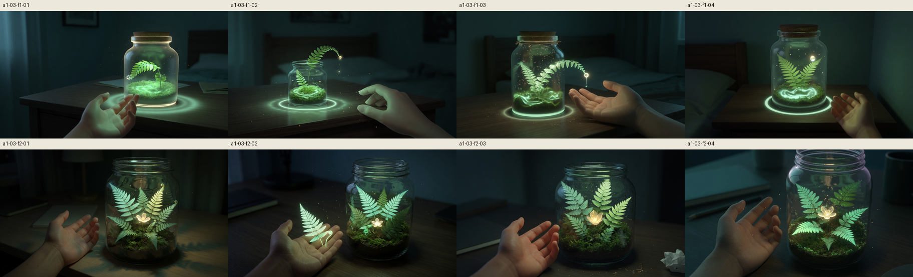

# A1-03 reference candidates

Provisional frames for G3 (the sixth breath, F1) and G4 (day 7, F2). Not anchors. The owner picks at R2.
Shared negative, plus the extra negative: neon, cyberpunk, harsh bloom, horror, glowing eyes.
Image generations for this sheet: 8. Tool: image_gen. Date: 2026-10-02.

- `a1-03-f1-01.png`: Corked jar and an open hand. The new frond arcs out through the glass, so the dew sits outside the jar. Ring reads as ripples on the desk.
- `a1-03-f1-02.png`: No cork. The frond grows out of the open mouth and the dew falls outside. Hand rests on the desk. A ring sits on the desk and a spiral sits in the moss.
- `a1-03-f1-03.png`: Corked jar, open palm, moss ripple, dew at the tip. The frond leaves the mouth and reaches the hand.
- `a1-03-f1-04.png`: Corked jar, both fronds inside the glass, dew hangs inside, full ring on the desk, open hand. Closest F1 to a contained jar.
- `a1-03-f2-01.png`: Open mouth, no cork. Flower at the centre, several fronds, open hand, warm lamp behind. Week reads, the quiet frond is not obvious.
- `a1-03-f2-02.png`: Open mouth. A glowing fern floats in the palm instead of leaning inside the jar. Flower is inside.
- `a1-03-f2-03.png`: Open mouth, bright flower, several fronds, open hand. A paper scrap sits on the desk. Flower is hotter than the mint palette.
- `a1-03-f2-04.png`: Open mouth, flower, several fronds, open hand. A faint purple rim. The missed-day frond is not clearly the quiet one.
