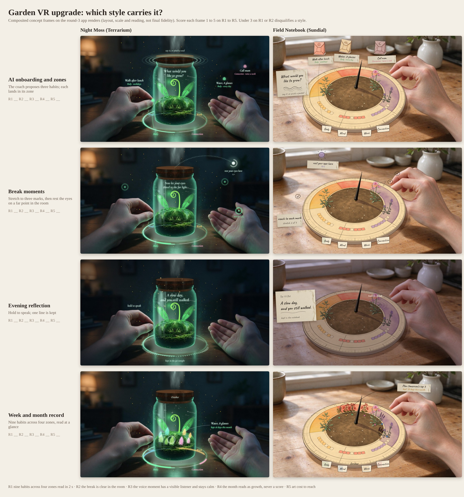

# Artboards: which style carries the upgrade

Task C4 of `docs/plans/upgrade-2026-10.md` (section 8). Eight frames: four moments, each drawn in both styles. The
owner scores them alone and picks the app by 2026-10-14; the pick is recorded as decision 0016.



| Moment | Night Moss (Terrarium) | Field Notebook (Sundial) |
|---|---|---|
| 1. AI onboarding and zones | [frame](night-moss/1-onboarding-zones.jpg) | [frame](field-notebook/1-onboarding-zones.jpg) |
| 2. Break moments | [frame](night-moss/2-breaks.jpg) | [frame](field-notebook/2-breaks.jpg) |
| 3. Evening reflection | [frame](night-moss/3-reflection.jpg) | [frame](field-notebook/3-reflection.jpg) |
| 4. Week and month record | [frame](night-moss/4-record.jpg) | [frame](field-notebook/4-record.jpg) |

## What the frames are, and are not

- **Composited concept frames.** Each one is an overlay drawn on an app render that is already in the repo, at its
  reference framing: `tools/fidelity/rungs/JarG1-level2-round3-midbreath.png` and
  `tools/fidelity/rungs/DialG1-level2-round3-idle.png` (the round-3 renders, rubric level 2). The added plants,
  packets and paper come from the apps' own `Art/Source` images, each with its prompt sidecar. No pixel of the owner's
  reference frames is used.
- **They show layout, scale and reading**, which R1 to R4 need. They do not show final fidelity, motion, or how the
  glass and ink hold up in a headset. The base renders are from round 3; the apps have moved on since then.
- **How each style shows zones:**
  - Night Moss: a glowing ring at the jar's base, split into four arcs. Each habit is a tinted sprig in its zone's part
    of the moss.
  - Field Notebook: four paper index tabs on the dial's rim, shaded in coloured pencil. Each habit is a plant on its
    time arc, with a coloured zone dot at its base.
- **Coach lines are examples**, not output from the model: "What would you like to grow?" and the journal line "A slow
  day, and you still walked." Real lines come from the Haiku evaluation (task C7).

## Scoring sheet (owner)

Score each frame 1 to 5. A style scoring under 3 on R1 or R2 in any frame is out for the slice; otherwise the higher
total wins.

| # | Criterion |
|---|---|
| R1 | 9 habits across 4 zones read in 2 seconds |
| R2 | The break moment is clear in passthrough and uses the real room |
| R3 | The voice moment shows a visible listener and stays calm |
| R4 | The monthly record reads as growth, never as a score |
| R5 | Art cost to reach: draws, triangles, and the distance from today's fidelity |

| Frame | R1 | R2 | R3 | R4 | R5 | Notes |
|---|---|---|---|---|---|---|
| Night Moss 1, onboarding and zones | | | | | | |
| Night Moss 2, breaks | | | | | | |
| Night Moss 3, reflection | | | | | | |
| Night Moss 4, record | | | | | | |
| **Night Moss total** | | | | | | |
| Field Notebook 1, onboarding and zones | | | | | | |
| Field Notebook 2, breaks | | | | | | |
| Field Notebook 3, reflection | | | | | | |
| Field Notebook 4, record | | | | | | |
| **Field Notebook total** | | | | | | |

Facts for R5 from the gate packs, as of 2026-10-09:
- Terrarium (`apps/terrarium/GATE.md`): A2 and A3 fail on the glass. The blind judge gives every gate frame a median
  of 2; 18 draws, 23,174 triangles.
- Sundial: round 3 rendered the dial in 15 draws and 10.4k triangles, and it was judged "closer" to its references
  (`docs/PLAN.md` section 2).

## Regenerating

```bash
# sprites from the apps' own art (Pillow)
python3 tools/artboards/prep.py /tmp/artboards-build
# optional fonts (OFL): npm i @fontsource/caveat @fontsource/cormorant-garamond in a scratch folder, then copy
# caveat-latin-400-normal.woff2, caveat-latin-600-normal.woff2 and cormorant-garamond-latin-500-italic.woff2 into one folder
node tools/artboards/frames.mjs /tmp/artboards-build docs/art/artboards <font-folder>
```

`frames.mjs` needs Playwright with Chromium (`PLAYWRIGHT_NODE_MODULES` points at the folder holding `playwright` if it
is not under `/opt/node22/lib/node_modules`). If the frames are too rough to judge, task W2 re-renders them with image
generation on the Windows machine.
